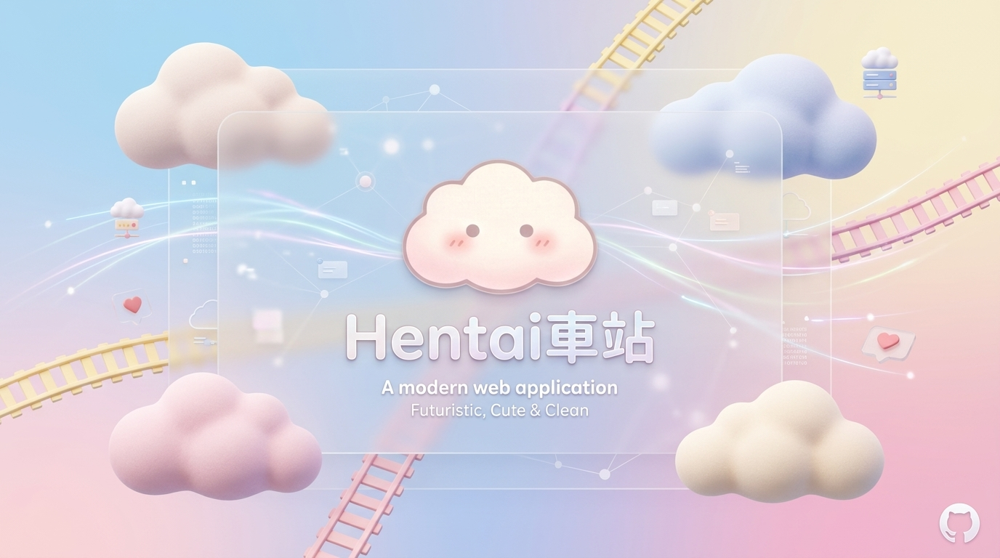
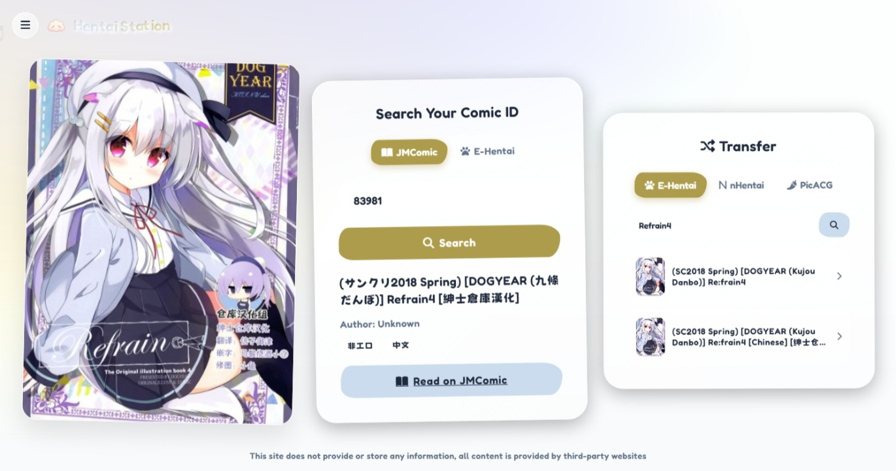

<div align="center">
  

  # 🚉 Hentai车站 (Hentai Station)
  
  **基于 Vite 和 Cloudflare Workers 构建的跨平台漫画代理转换平台**
  
  <p align="center">
    
    
    
  </p>

  <p>
    提供 JMComic 漫画编号与 E-Hentai、哔咔漫画 (PicACG)、nHentai 等其他平台之间的快速检索与一键换乘。
  </p>

  <p align="center">
    <a href="README_EN.md">English</a> | <b>简体中文</b>
  </p>
</div>

---

## ✨ 核心特性

- 🔍 **智能检索**：输入 JMComic 车牌号或 E-Hentai 关键词，一键解析获取漫画的封面、作者、完整标签信息。
- 🚄 **跨平台换乘**：内置跨站搜索机制，检索后可直接在 E-Hentai、哔咔漫画、nHentai 中进行精确匹配，实现平台无缝跳转。
- 🌍 **全自动标签翻译**：内置 `EhTagTranslation` 引擎，实现漫画标签的中/英/日多语言转换，支持本地 IndexedDB 缓存和热更新。
- 🛡️ **无状态代理架构**：采用 Cloudflare Workers 作为 API 代理层，突破 CORS 限制，并在服务端完成数据加解密，不记录任何用户隐私数据。
- 🎨 **现代化 UI**：采用流畅的玻璃拟态设计与响应式布局，内置基于 `prefers-reduced-motion` 的优雅降级策略及 NSFW 智能模糊保护。

---

## 📸 预览图

<div align="center">
  
</div>

---

## 🚀 部署与使用

本项目分为前端（Vite）和后端代理（Cloudflare Workers）两部分。

### ☁️ 一键部署 (推荐)

[](https://deploy.workers.cloudflare.com/?url=https://github.com/WenqiOfficial/jm-is-hentai)

### 💻 本地开发与手动部署

如果你需要进行二次开发或手动分离部署，请参考以下步骤：

#### 1. 安装依赖

```bash
git clone https://github.com/WenqiOfficial/jm-is-hentai.git
cd jm-is-hentai
npm install
```

#### 2. 前端部署 (Frontend)

你可以使用任意静态网页托管服务（如 Cloudflare Pages, Vercel, Netlify）部署 `frontend` 目录。

```bash
# 本地启动开发服务器
npm run dev

# 构建生产环境代码
npm run build
```

#### 3. 后端代理部署 (Worker)

手动通过 Wrangler 部署 Worker 到 Cloudflare：

```bash
# 本地测试 Worker 代理
npm run worker:dev

# 一键部署至 Cloudflare
npm run worker:deploy
```

> **💡 KV 缓存加速优化**：
> 在部署 Worker 之前，推荐在 `wrangler.toml` 中配置 `JM_CACHE` 命名空间，开启 Cloudflare KV 缓存以降低源站 API 的请求压力。

---

## 🔌 核心 API 端点

通过自行部署的 Worker 代理，你可以调用以下 API 接口（详见 `START.md`）：

- `GET /api/jmcomic/:id` - 解析 JMComic 车牌
- `GET /api/jmcomic/search?q={keyword}` - 搜索 JMComic 画廊
- `GET /api/ehentai/search?q={keyword}` - 搜索 E-Hentai 列表
- `GET /api/ehentai/gallery?gid={gid}&token={token}` - 获取 E-Hentai 画廊详细元数据

---

## 🌟 Star 历史

<div align="center">
  <a href="https://star-history.com/#WenqiOfficial/jm-is-hentai&Date">
    <picture>
      <source media="(prefers-color-scheme: dark)" srcset="https://api.star-history.com/svg?repos=WenqiOfficial/jm-is-hentai&type=Date&theme=dark" />
      <source media="(prefers-color-scheme: light)" srcset="https://api.star-history.com/svg?repos=WenqiOfficial/jm-is-hentai&type=Date" />
      
    </picture>
  </a>
</div>

---

## 💖 贡献者名单

感谢所有为本项目做出贡献的开发者！

<div align="center">
  <a href="https://github.com/WenqiOfficial/jm-is-hentai/graphs/contributors">
    
  </a>
</div>

---

## 🤝 贡献与支持

欢迎提交 Issue 或 Pull Request，帮助完善功能。

本项目基于 [MIT License](LICENSE) 协议开源。

<p align="right">
  <i>✨ 本项目借助 Gemini 辅助开发</i>
</p>
